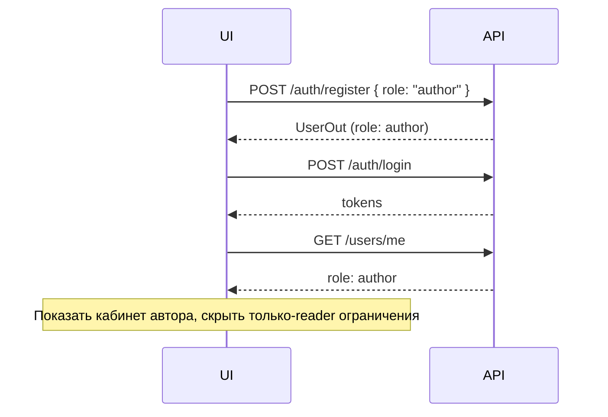
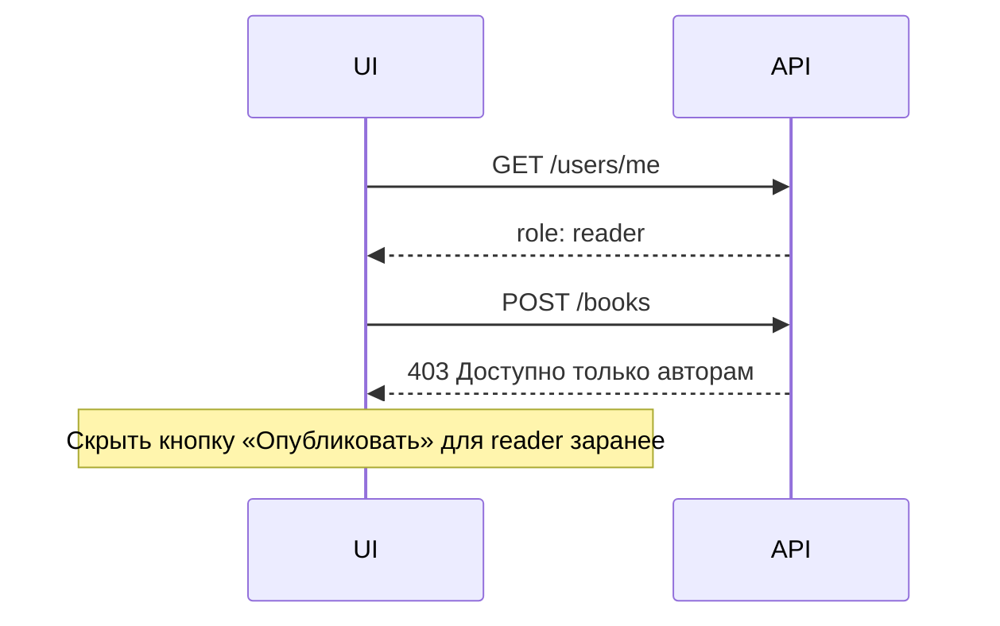
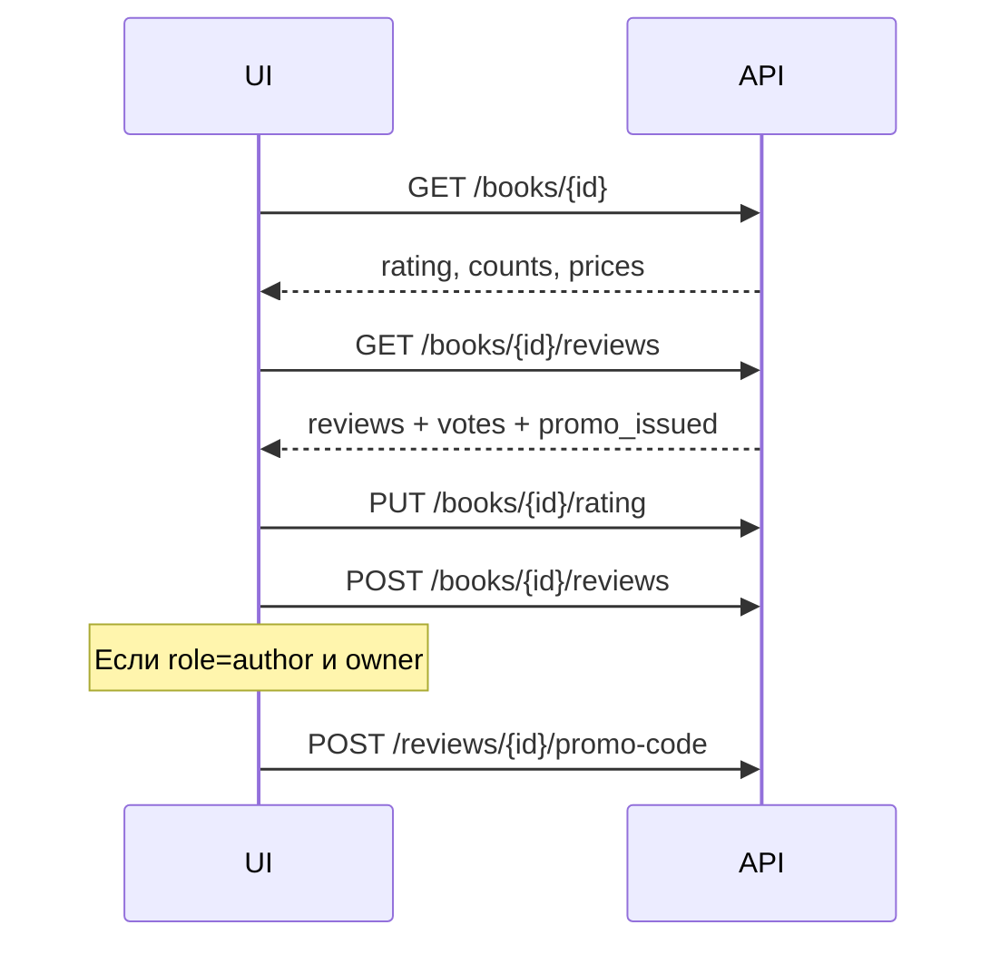
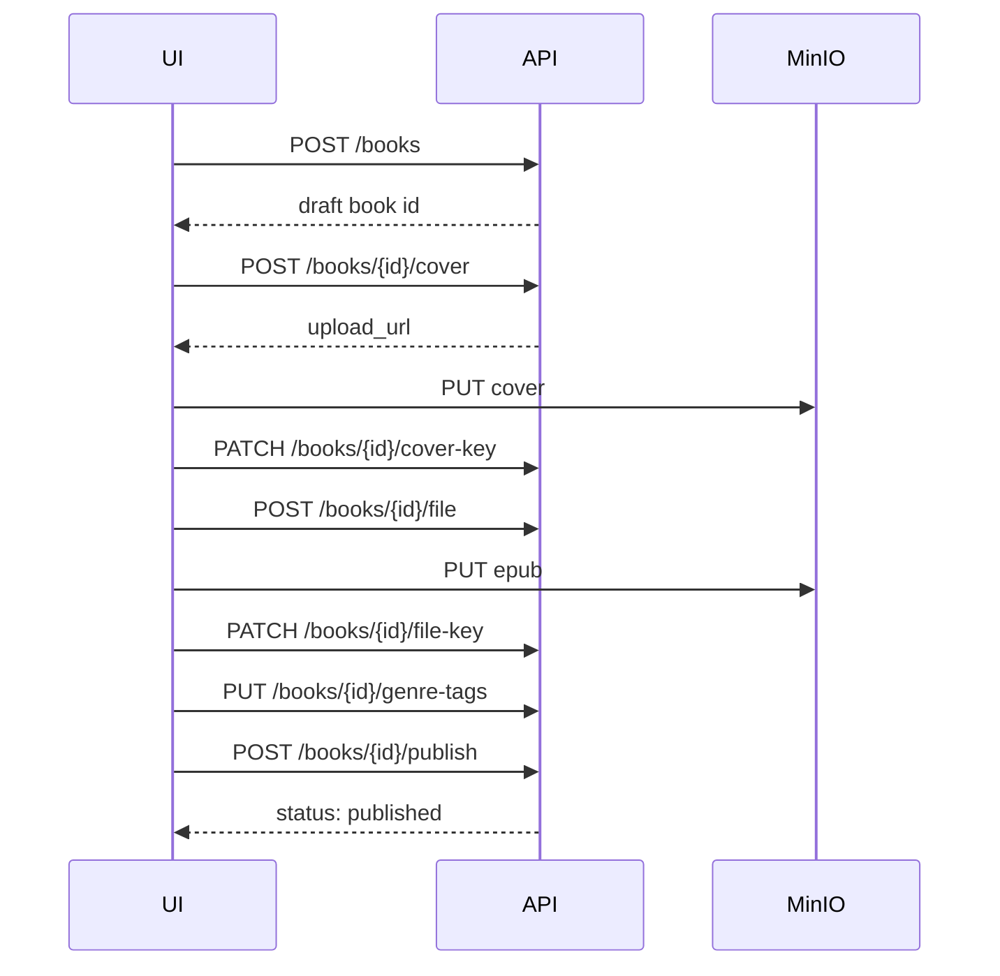

# AeonBiblio — API для фронтенда

Полная спецификация интеграции React-приложения с backend.

**Base URL:** `http://localhost:8000`  
**Swagger:** http://localhost:8000/docs  
**OpenAPI JSON:** http://localhost:8000/openapi.json

---

## Содержание

1. [Запуск backend](#запуск-backend)
2. [Аутентификация](#аутентификация)
3. [Роли: читатель и автор](#роли-читатель-и-автор)
4. [Матрица доступа по endpoints](#матрица-доступа-по-endpoints)
5. [Экран Figma → API](#экран-figma--api)
6. [Пользователь](#пользователь)
7. [Книги](#книги)
8. [Отзывы и промокоды](#отзывы-и-промокоды)
9. [Библиотека читателя](#библиотека-читателя)
10. [Кабинет автора](#кабинет-автора)
11. [Покупка, подписка, чтение](#покупка-подписка-чтение)
12. [Типовые сценарии (flows)](#типовые-сценарии-flows)
13. [Ошибки и enum-ы](#ошибки-и-enum-ы)
14. [Рекомендации для React-приложения](#рекомендации-для-react-приложения)

---

## Запуск backend

```powershell
# Windows
.\scripts\start.ps1

# или
docker compose up --build
```

```bash
# Linux/macOS
./scripts/start.sh
```

Поднимается: PostgreSQL, MinIO, миграции, seed, uvicorn на `:8000`.

---

## Аутентификация

Все защищённые запросы:

```http
Authorization: Bearer <access_token>
```

| Метод | Endpoint | Тело | Ответ |
|-------|----------|------|-------|
| POST | `/auth/register` | см. ниже | `UserOut` (201) |
| POST | `/auth/login` | `{ email, password }` | `TokenPair` (200) |
| POST | `/auth/refresh` | `{ refresh_token }` | `TokenPair` (200) |
| POST | `/auth/logout` | `{ refresh_token }` | 204 |

### POST /auth/register

```json
{
  "email": "user@example.com",
  "username": "leonid",
  "password": "password123",
  "role": "reader"
}
```

| Поле | Обязательно | Описание |
|------|-------------|----------|
| `email` | да | Email, уникальный |
| `username` | да | 3–50 символов, уникальный |
| `password` | да | минимум 8 символов |
| `role` | нет | `"reader"` (по умолчанию) или `"author"` |

**Важно:** роль задаётся **только при регистрации**. После создания аккаунта её нельзя сменить через API.

### TokenPair

```json
{
  "access_token": "eyJ...",
  "refresh_token": "eyJ...",
  "token_type": "bearer"
}
```

При `401` на любом запросе — обновите access token через `/auth/refresh`. Если refresh тоже истёк — перенаправьте на логин.

---

## Роли: читатель и автор

В системе две **жёсткие** роли (`UserRole`):

| Роль | Значение | Кто это |
|------|----------|---------|
| Читатель | `"reader"` | Покупает/читает книги, пишет отзывы, ведёт библиотеку |
| Автор | `"author"` | Публикует книги, видит статистику и баланс, выдаёт промокоды |

### Что это значит для UI

1. **Переключатель «Читатель / Автор» в Figma — это не PATCH профиля.**  
   Backend не поддерживает смену роли. Варианты реализации на фронте:
   - **Два отдельных аккаунта** (рекомендуется для MVP): пользователь логинится как читатель или как автор.
   - **Два flow регистрации**: «Я читаю» → `role: "reader"`, «Я публикую» → `role: "author"`.
   - Переключатель в UI может означать **logout + login** под другим аккаунтом или **выбор типа регистрации** на экране signup.

2. **Поле `role` приходит в `GET /users/me`** — используйте его для роутинга и скрытия недоступных разделов.

3. **403 «Доступно только авторам»** — читатель обратился к author-only endpoint. Покажите сообщение или скройте кнопку заранее по `role !== "author"`.

4. **Автор тоже может читать** — все reader-endpoints доступны автору (покупки, библиотека, отзывы, чтение книг).

### Пример проверки на фронте

```typescript
type UserRole = "reader" | "author";

interface UserOut {
  id: string;
  email: string;
  username: string;
  display_tag: string | null;
  avatar_key: string | null;
  role: UserRole;
  is_email_verified: boolean;
  created_at: string;
}

function isAuthor(user: UserOut): boolean {
  return user.role === "author";
}

// В роутере
if (route.meta.requiresAuthor && !isAuthor(currentUser)) {
  redirect("/library"); // или экран «Нужен аккаунт автора»
}
```

---

## Матрица доступа по endpoints

Легенда: **🌐** — без авторизации · **👤** — любой авторизованный · **📖** — читатель или автор · **✍️** — только автор · **⭐** — активная подписка

### Auth

| Endpoint | Доступ |
|----------|--------|
| `POST /auth/register` | 🌐 |
| `POST /auth/login` | 🌐 |
| `POST /auth/refresh` | 🌐 |
| `POST /auth/logout` | 🌐 |

### Users

| Endpoint | Доступ |
|----------|--------|
| `GET /users/by-username/{username}` | 🌐 |
| `GET /users/me` | 👤 |
| `PATCH /users/me` | 👤 (username, display_tag — **не role**) |
| `PATCH /users/me/password` | 👤 |
| `POST /users/me/avatar` | 👤 |
| `PATCH /users/me/avatar-key` | 👤 |
| `GET /users/me/promo-codes` | 📖 |
| `GET/PATCH /users/me/payment-profile` | 👤 |

### Books — каталог и чтение

| Endpoint | Доступ |
|----------|--------|
| `GET /books` | 🌐 (фильтры: q, status, author_id, genre_tag_id, …) |
| `GET /books/recommendations` | 🌐 / 👤 (если передан token — персонализация) |
| `GET /books/{id}` | 🌐 |
| `GET /books/{id}/rating` | 🌐 / 👤 (my_rating если token) |
| `PUT /books/{id}/rating` | 📖 |
| `GET /books/{id}/reviews` | 🌐 |
| `GET /books/{id}/genre-tags` | 🌐 |
| `GET /books/{id}/user-tags` | 🌐 |
| `POST /books/{id}/user-tags` | 📖 |
| `DELETE /books/{id}/user-tags/{tag_id}` | 📖 |
| `GET /books/{id}/access` | 📖 |
| `GET /books/{id}/content` | 📖 (нужен доступ: подписка / покупка / автор книги) |
| `GET /books/{id}/content/chunk` | 📖 |

### Books — управление (только автор)

| Endpoint | Доступ | Доп. проверка |
|----------|--------|---------------|
| `POST /books` | ✍️ | — |
| `PATCH /books/{id}` | ✍️ | только свои книги |
| `DELETE /books/{id}` | ✍️ | только свои |
| `POST /books/{id}/submit` | ✍️ | только свои |
| `POST /books/{id}/publish` | ✍️ | только свои |
| `POST /books/{id}/cover` | ✍️ | только свои |
| `PATCH /books/{id}/cover-key` | ✍️ | только свои |
| `POST /books/{id}/file` | ✍️ | только свои |
| `PATCH /books/{id}/file-key` | ✍️ | только свои |
| `PUT /books/{id}/genre-tags` | ✍️ | только свои |
| `POST /genre-tags` | ✍️ | — |

### Reviews

| Endpoint | Доступ |
|----------|--------|
| `POST /books/{id}/reviews` | 📖 |
| `PATCH /reviews/{id}` | 📖 (только свой отзыв) |
| `DELETE /reviews/{id}` | 📖 (свой) или ✍️ (автор книги) |
| `PUT /reviews/{id}/vote` | 📖 |
| `DELETE /reviews/{id}/vote` | 📖 |
| `POST /reviews/{id}/promo-code` | ✍️ (автор **этой** книги) |

### Library (читатель)

| Endpoint | Доступ |
|----------|--------|
| `GET /library/recent` | 📖 |
| `GET/POST /library/readlists` | 📖 |
| `PATCH/DELETE /library/readlists/{id}` | 📖 (владелец) |
| `POST/DELETE /library/readlists/{id}/books` | 📖 (владелец) |

### Subscriptions

| Endpoint | Доступ |
|----------|--------|
| `GET /subscriptions/plans` | 🌐 |
| `POST /subscriptions/subscribe` | 📖 |
| `GET /subscriptions/me` | 📖 |
| `POST /subscriptions/me/cancel` | 📖 |

### Earnings — читатель

| Endpoint | Доступ |
|----------|--------|
| `POST /earnings/purchases/{book_id}` | 📖 |
| `GET /earnings/purchases` | 📖 |
| `POST /earnings/reads/{book_id}` | ⭐ (активная подписка) |

### Earnings — автор

| Endpoint | Доступ |
|----------|--------|
| `GET /earnings/balance` | ✍️ |
| `GET /earnings/stats` | ✍️ |
| `GET /earnings/stats/books` | ✍️ |
| `GET /earnings/transactions` | ✍️ |
| `POST /earnings/payouts` | ✍️ |
| `GET /earnings/payouts` | ✍️ |
| `GET /earnings/promo-codes` | ✍️ |

---

## Экран Figma → API

| Экран / элемент | Endpoints | Примечание |
|-----------------|-----------|------------|
| Регистрация читателя | `POST /auth/register` | `{ role: "reader" }` или без role |
| Регистрация автора | `POST /auth/register` | `{ role: "author" }` |
| Вход | `POST /auth/login` | role в ответе через `/users/me` |
| Главная / каталог | `GET /books`, `/books/recommendations` | |
| Фильтр жанра | `GET /books?genre_tag_id=` | |
| Страница книги | `GET /books/{id}`, `/rating`, `/reviews` | |
| Оценка 1–10 | `PUT /books/{id}/rating` | `{ score: 8 }` |
| Рецензия | `POST /books/{id}/reviews` | `sentiment`: positive/negative/neutral |
| Лайки отзыва | `PUT/DELETE /reviews/{id}/vote` | |
| Выдать купон (автор) | `POST /reviews/{id}/promo-code` | только если `user.role === "author"` |
| Читалка | `/books/{id}/access`, `/content`, `/content/chunk` | |
| Покупка | `POST /earnings/purchases/{id}` | `promo_code` опционально |
| Подписка | `/subscriptions/*` | |
| ЛК читателя | `/library/recent`, `/library/readlists`, `/subscriptions/me`, `/users/me/promo-codes` | |
| ЛК автора | `/books?author_id=`, `/earnings/stats`, `/earnings/stats/books`, `/earnings/balance` | скрыть для `role !== "author"` |
| Публикация книги | `POST /books` → upload → `POST /books/{id}/publish` | только автор |
| Настройки профиля | `PATCH /users/me` | **без смены role** |

---

## Пользователь

### GET /users/me

```json
{
  "id": "550e8400-e29b-41d4-a716-446655440000",
  "email": "author@example.com",
  "username": "leonid",
  "display_tag": "#610791",
  "avatar_key": "avatars/uuid.jpg",
  "role": "author",
  "is_email_verified": false,
  "created_at": "2026-06-22T12:00:00Z"
}
```

### PATCH /users/me

```json
{
  "username": "newname",
  "display_tag": "#1234"
}
```

Поля `role`, `email`, `password` через этот endpoint **не меняются**.

### GET /users/by-username/{username}

Публичный профиль (без email):

```json
{
  "id": "uuid",
  "username": "leonid",
  "display_tag": "#610791",
  "avatar_key": "avatars/uuid.jpg",
  "role": "author"
}
```

### Аватар (двухшаговая загрузка)

1. `POST /users/me/avatar` → `{ upload_url, object_key }`
2. PUT файл на `upload_url` (MinIO presigned)
3. `PATCH /users/me/avatar-key?object_key=avatars/uuid.jpg`

---

## Книги

### GET /books

Query-параметры:

| Параметр | Тип | Описание |
|----------|-----|----------|
| `q` | string | Поиск по title |
| `status` | enum | draft, pending, published, rejected |
| `author_id` | uuid | Книги конкретного автора (ЛК автора) |
| `genre_tag_id` | uuid | Фильтр по жанру |
| `in_subscription` | bool | Только в подписке |
| `for_sale` | bool | Только на продажу |
| `offset`, `limit` | int | Пагинация |

Элемент списка (`BookListItem`):

```json
{
  "id": "uuid",
  "title": "Мартин Иден",
  "author_id": "uuid",
  "cover_key": "covers/uuid.jpg",
  "status": "published",
  "is_in_subscription": true,
  "is_for_sale": true,
  "sale_price": "245.00",
  "average_rating": "8.1",
  "ratings_count": 21,
  "reviews_count": 5
}
```

### GET /books/{id}

Те же поля + `description`, `file_format`, `file_size_bytes`, `my_rating` (если авторизован).

### Рейтинг 1–10 (отдельно от текстовых рецензий)

```http
GET /books/{id}/rating
PUT /books/{id}/rating
Content-Type: application/json

{ "score": 8 }
```

Ответ (`BookRatingOut`):

```json
{
  "average_rating": "8.1",
  "ratings_count": 21,
  "reviews_count": 5,
  "my_rating": 8
}
```

**UI:** строка «21 оценка · 5 рецензий» = `ratings_count` + `reviews_count`.

### Создание и публикация (flow автора)

```
1. POST /books
   { "title": "...", "description": "...", "is_for_sale": true, "sale_price": "299.00", ... }
   → BookOut (status: draft)

2. POST /books/{id}/cover → upload_url → PATCH .../cover-key

3. POST /books/{id}/file?file_format=epub → upload_url → PATCH .../file-key

4. PUT /books/{id}/genre-tags
   { "genre_tag_ids": ["uuid1", "uuid2"] }

5. POST /books/{id}/submit   → status: pending (опционально, если нужна модерация)

6. POST /books/{id}/publish  → status: published
```

Шаги 1–6 требуют `role: "author"`. Иначе **403**.

### PATCH /books/{id}

Обновление метаданных (title, description, цены, флаги подписки/продажи). Только свои книги.

### Upload (обложка и файл)

```http
POST /books/{id}/cover
→ { "upload_url": "https://minio...", "object_key": "covers/{id}.jpg" }

PATCH /books/{id}/cover-key?object_key=covers/{id}.jpg

POST /books/{id}/file?file_format=epub
→ { "upload_url": "...", "object_key": "books/{id}.epub" }

PATCH /books/{id}/file-key?object_key=books/{id}.epub&file_format=epub&file_size_bytes=1048576
```

---

## Отзывы и промокоды

### GET /books/{book_id}/reviews

```json
{
  "id": "uuid",
  "user_id": "uuid",
  "username": "slavik",
  "display_tag": "#13",
  "rating": 5,
  "sentiment": "positive",
  "text": "Отличная книга",
  "promo_issued": true,
  "likes_count": 31,
  "dislikes_count": 2,
  "my_vote": "like",
  "created_at": "2026-06-22T12:00:00Z"
}
```

| Поле | UI |
|------|-----|
| `sentiment` | positive / negative / neutral — цвет карточки |
| `promo_issued: true` | бейдж «Автор выдал купон» |
| `my_vote` | like / dislike / null |

Кнопка «Выдать купон» — показывать если:
- текущий пользователь — **автор** (`role === "author"`);
- он автор **этой книги**;
- `promo_issued === false`;
- отзыв не его собственный.

### POST /books/{book_id}/reviews

```json
{
  "rating": 5,
  "sentiment": "positive",
  "text": "Отличная книга"
}
```

### Голосование

```http
PUT /reviews/{id}/vote
{ "vote": "like" }   // или "dislike"

DELETE /reviews/{id}/vote
```

### Промокод по отзыву (только автор)

```http
POST /reviews/{review_id}/promo-code
{
  "discount_percent": 20,
  "expires_in_days": 30
}
```

Ответ — `PromoCodeOut` с полем `code`. Код одноразовый, привязан к получателю (автору отзыва).

### Промокоды читателя

```http
GET /users/me/promo-codes
```

Активные (не использованные, не просроченные) промокоды текущего пользователя.

### Список промокодов автора

```http
GET /earnings/promo-codes?offset=0&limit=20
```

---

## Библиотека читателя

### Последние открытые

```http
GET /library/recent?limit=20
```

```json
{
  "book_id": "uuid",
  "title": "Мартин Иден",
  "cover_key": "covers/uuid.jpg",
  "status": "reading",
  "progress_percent": 35,
  "updated_at": "2026-06-22T12:00:00Z"
}
```

### Readlists (коллекции)

```
GET    /library/readlists
POST   /library/readlists          { "title", "description", "is_public" }
PATCH  /library/readlists/{id}
DELETE /library/readlists/{id}
POST   /library/readlists/{id}/books     { "book_id" }
DELETE /library/readlists/{id}/books/{book_id}
```

---

## Кабинет автора

Доступен только при `role === "author"`. Иначе все запросы ниже вернут **403**.

### Мои книги

```http
GET /books?author_id={my_user_id}&status=published
GET /books?author_id={my_user_id}&status=draft
```

### Статистика (общая)

```http
GET /earnings/stats
GET /earnings/stats?year=2026&month=5
```

```json
{
  "total_reads": 1024,
  "total_sales": 123,
  "total_earned": "18123.23",
  "available_amount": "234.23",
  "pending_amount": "0.00",
  "period": { "year": 2026, "month": 5 }
}
```

- Без `year`/`month` — за всё время, `period: null`
- С фильтром — `period` заполнен

### Статистика по книгам

```http
GET /earnings/stats/books?q=мартин&year=2026&month=5&offset=0&limit=20
```

```json
{
  "book_id": "uuid",
  "title": "Мартин Иден",
  "cover_key": "covers/uuid.jpg",
  "reads": 125,
  "sales": 14,
  "income": "341.00"
}
```

### Баланс и выплаты

```http
GET  /earnings/balance
POST /earnings/payouts       { "amount": "100.00" }
GET  /earnings/payouts
GET  /earnings/transactions?offset=0&limit=20
```

---

## Покупка, подписка, чтение

### Покупка книги

```http
POST /earnings/purchases/{book_id}
{
  "card_number": "4111111111111111",
  "cardholder_name": "TEST USER",
  "expiry_month": 12,
  "expiry_year": 2030,
  "cvv": "123",
  "promo_code": "ABC12345"
}
```

`promo_code` — опционально. Mock-оплата: карта `4111...` всегда проходит.

### Подписка

```http
GET  /subscriptions/plans
POST /subscriptions/subscribe   { "plan_id": "uuid", ...card fields... }
GET  /subscriptions/me
POST /subscriptions/me/cancel
```

### Открытие книги по подписке (начисление автору)

```http
POST /earnings/reads/{book_id}
```

Требует активную подписку (`403` «Требуется активная подписка»). Вызывайте при первом открытии книги из каталога подписки.

### Проверка доступа и чтение

```http
GET /books/{id}/access
```

```json
{
  "can_read": true,
  "reason": null,
  "file_size_bytes": 1048576,
  "file_format": "epub"
}
```

Если `can_read: false`, покажите CTA: купить / оформить подписку.

```http
GET /books/{id}/content
GET /books/{id}/content/chunk?offset=0&size=262144
```

- Прямого **download** нет — только inline-чтение (`Content-Disposition: inline`).
- Chunk — для постраничной/потоковой подгрузки (до 1 MiB за запрос).

### Логика доступа (`can_read`)

| Условие | Доступ |
|---------|--------|
| Пользователь — автор книги | да |
| Книга куплена | да |
| Активная подписка + книга `is_in_subscription` | да |
| Иначе | нет |

---

## Типовые сценарии (flows)

### Flow: регистрация и определение интерфейса



### Flow: читатель пытается создать книгу



### Flow: страница книги



### Flow: публикация книги (автор)



### Flow: чтение книги

```mermaid
sequenceDiagram
    participant UI
    participant API

    UI->>API: GET /books/{id}/access
    alt can_read
        UI->>API: GET /books/{id}/content/chunk
        API-->>UI: bytes + Content-Range
    else no access
        UI->>API: POST /earnings/purchases/{id}
        or POST /subscriptions/subscribe
    end
```

---

## Ошибки и enum-ы

### HTTP-коды

| Код | Когда | detail (примеры) |
|-----|-------|------------------|
| 401 | Нет/невалидный token | «Не удалось проверить учётные данные» |
| 403 | Нет прав | «Доступно только авторам», «Требуется активная подписка», «Аккаунт заблокирован» |
| 404 | Не найдено | «Книга не найдена», «Баланс не найден» |
| 409 | Конфликт | «Книга уже куплена», «Username уже занят» |
| 422 | Validation error | Pydantic field errors |

### Enum-ы

| Имя | Значения |
|-----|----------|
| `UserRole` | `reader`, `author` |
| `BookStatus` | `draft`, `pending`, `published`, `rejected` |
| `ReviewSentiment` | `positive`, `negative`, `neutral` |
| `ReviewVoteType` | `like`, `dislike` |
| `ReadingStatus` | `reading`, `finished`, `wishlist` |

---

## Рекомендации для React-приложения

### 1. Хранение сессии

```typescript
// После login сохраните tokens + загрузите профиль
const { access_token, refresh_token } = await login(email, password);
localStorage.setItem("access_token", access_token);
localStorage.setItem("refresh_token", refresh_token);
const me = await api.get("/users/me");
setUser(me.data); // включая role
```

### 2. HTTP-клиент с refresh

```typescript
api.interceptors.response.use(
  (r) => r,
  async (error) => {
    if (error.response?.status === 401 && !error.config._retry) {
      error.config._retry = true;
      const refresh = localStorage.getItem("refresh_token");
      const { data } = await axios.post("/auth/refresh", { refresh_token: refresh });
      localStorage.setItem("access_token", data.access_token);
      error.config.headers.Authorization = `Bearer ${data.access_token}`;
      return api(error.config);
    }
    return Promise.reject(error);
  }
);
```

### 3. Роутинг по ролям

| Маршрут | `reader` | `author` |
|---------|----------|----------|
| `/library`, `/book/:id`, `/read/:id` | ✅ | ✅ |
| `/author/dashboard`, `/author/books/new` | ❌ (redirect) | ✅ |
| `/author/stats`, `/author/payouts` | ❌ | ✅ |

### 4. Переключатель «Читатель / Автор» в Figma

Рекомендуемая реализация:

```typescript
// НЕ делать:
// await api.patch("/users/me", { role: "author" }); // такого поля нет

// Делать одно из:
// A) Два аккаунта — logout + login
// B) На signup — radio «Я читаю» / «Я публикую» → role в register body
// C) Два таба на login с разными demo-аккаунтами
```

### 5. Обложки и аватары

`cover_key` и `avatar_key` — ключи объектов в MinIO. Для dev можно:
- запрашивать presigned GET на backend (если добавите proxy);
- или собирать URL по convention вашего окружения.

### 6. Деньги

Все суммы — строки с двумя знаками после запятой (`"245.00"`). Используйте `Decimal`/big.js на фронте при расчётах.

### 7. Mock-платежи

Карта `4111111111111111`, любой CVV и будущая дата — оплата всегда успешна.

### 8. TypeScript types (скелет)

```typescript
export type UserRole = "reader" | "author";

export interface UserOut {
  id: string;
  email: string;
  username: string;
  display_tag: string | null;
  avatar_key: string | null;
  role: UserRole;
  is_email_verified: boolean;
  created_at: string;
}

export interface RegisterBody {
  email: string;
  username: string;
  password: string;
  role?: UserRole;
}
```

---

## Health

```http
GET /health
→ { "status": "ok" }
```

Используйте для проверки доступности API перед login/register.
